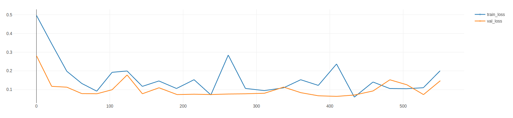
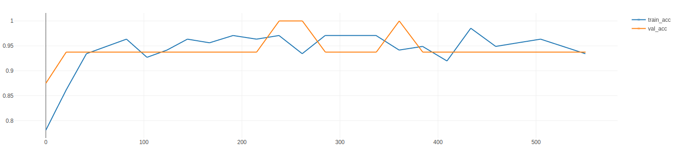

# Two-Class Classifier for Field and Road Images using PyTorch

the paper can be found here : https://arxiv.org/abs/2307.06304

## Overview:

I created a two-class classifier for field and road images using PyTorch. This classifier was trained to distinguish between "Field" and "Road" images.

## Data Preprocessing:

Images were organized into two subdirectories for each class. The images were resized to a consistent size, and data augmentation techniques were applied to increase diversity: RandAugment was used due to its efficacy on the ImageNet dataset and image classification in general. The dataset was randomly split into training and validation sets.

## Model Architecture:

I used a pre-trained ResNet-18 model as a base architecture. The final fully connected layer was modified to have two output units corresponding to the two classes. Activation functions were added accordingly.

## Config File:

Hyperparameters such as device, image size, learning rate, and others were stored in a separate config file. This approach allowed easy adjustment of hyperparameters without modifying the main code.

## Execution:
In order to run this code you will need : 

- Python 3.8
- torch 1.13
- mlflow
- sklearn
- everything else is standard Python libraries

The main code loaded hyperparameters from the config file and carried out the entire process, from model creation to training and evaluation.

## Model Evaluation:

The trained model was evaluated on the validation set. Metrics such as loss and accuracy were tracked for both the training and validation phases using Mlflow for experiment tracking. The model's performance was monitored over multiple epochs.

Here are the learning curves : 

### the loss :

### the accuracy :

** While these curves do not look perfect, getting the best results was not the focus of this work but rather show the feasability.
 
## Predictions on New Data:

The predictions of the model can be found in the notebook : *prediction.ipynb*